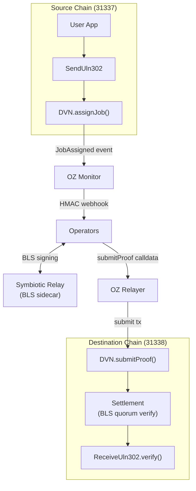
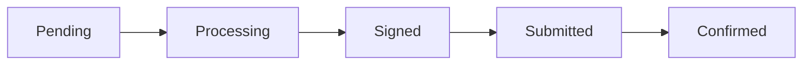

# Architecture

System overview for the Symbiotic multi-provider template.

## Core Model

1. One active provider per running stack (`config/root.config.json`).
2. Shared off-chain runtime:
- OZ Monitor for ingress
- 3 operator processes
- 3 Symbiotic relay sidecars for BLS signatures
- OZ Relayer for destination tx submission
- Redis queue
3. Provider-specific on-chain contracts and calldata format.

## Provider Matrix

| Provider | Source ingress event | Destination submit call | Destination verification condition |
| --- | --- | --- | --- |
| `layerzero` | `JobAssigned` | `SymbioticLayerZeroDVN.submitProof(...)` | Destination target verification/forward path |
| `chainlink_ccv` | `CCIPMessageSent` | `OffRamp.execute(...)` | `MessageExecuted(messageId)` + `SymbioticCCV.verifyMessage(...)` |

## CCV Scope Assumption

This template supports the **Symbiotic CCV variant** only.

Not in local scope:
1. Chainlink CCV auxiliary devenv stack (`aggregator`, `indexer`, `verifier`, `executor`).
2. External protocol attestation providers (for example CCTP token attestors).

## LayerZero Flow

1. Source emits `JobAssigned`.
2. Monitor forwards webhook payloads to operators.
3. Operators batch messages into Merkle roots and collect BLS signatures via sidecars.
4. Relayer submits proof to destination DVN contract.
5. Destination DVN verifies quorum through settlement and continues protocol flow.

## Symbiotic CCV Flow

1. Source OnRamp-compatible contract emits `CCIPMessageSent`.
2. Monitor forwards event payloads to operators.
3. Operators build CCV payload and collect Symbiotic BLS attestation.
4. Relayer submits destination `OffRamp.execute(...)`.
5. OffRamp-compatible destination contract calls `SymbioticCCV.verifyMessage(...)` for each supplied CCV.
6. On success destination emits `MessageExecuted(messageId,...)`.

`scripts/msg watch` for `chainlink_ccv` treats success only when destination `MessageExecuted` is found on-chain.

## Merkle Tree Batching

Messages are batched into Merkle trees for gas efficiency:

1. Multiple messages are collected into a batch
2. Each message becomes a leaf in the Merkle tree
3. The Merkle root is signed by operators
4. Proofs allow verifying individual messages against the signed root

This means:
- One signature covers many messages
- On-chain verification cost is amortized
- Individual messages can be verified independently

## Symbiotic Integration

Symbiotic provides the shared security layer:

- **Operator Registration**: Operators stake and register their BLS public keys
- **Settlement Contract**: Verifies BLS signatures and checks quorum
- **Slashing**: Misbehaving operators can be penalized (production)

The Settlement contract:
1. Maintains the list of registered operators and their public keys
2. Defines the quorum threshold
3. Verifies aggregated signatures
4. Reports verification results to the DVN

## BLS Role (Both Providers)

1. Operators sign provider-defined payloads through Symbiotic relay sidecars.
2. Aggregation/quorum logic comes from settlement-backed Symbiotic attestation rules.
3. Provider-specific contracts decode and enforce those attestations on destination execution path.

## System Diagram



## Development Topology

```text
Source chain (31337)                         Destination chain (31338)
--------------------                         ------------------------
LayerZero: JobAssigned                       LayerZero: DVN.submitProof verify path
CCV:      CCIPMessageSent                    CCV:      OffRamp.execute -> SymbioticCCV.verifyMessage

              OZ Monitor -> Operators -> Symbiotic Relays -> OZ Relayer
                                (shared off-chain runtime)
```

**Message status lifecycle:**



See [Operator Guide](operator-guide.md) for detailed internal
architecture (SignerJob, RelaySubmitterJob, storage).

## Production vs Development

| Aspect | Development | Production |
|--------|-------------|------------|
| Operators | 3 (local containers) | 1+ (distributed) |
| Chains | Anvil (local) | Mainnet/Testnet |
| BLS Keys | Generated | Hardware security |
| Quorum | 2-of-3 | Configurable |
| OZ Services | Local | Hosted by OZ |
