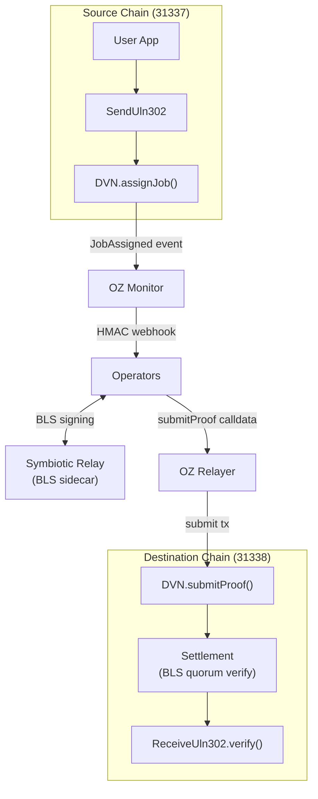
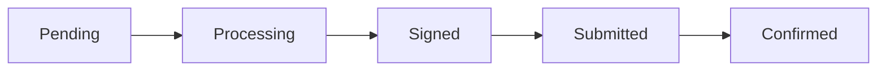

# Architecture

System overview of the Symbiotic LayerZero DVN template.

## Components

The DVN consists of several coordinated services:

| Component | Role |
|-----------|------|
| **Operators** | Rust services that receive events, batch messages, and coordinate signing |
| **Symbiotic Relay** | BLS signing sidecars that manage operator keys and produce signatures |
| **OZ Monitor** | Watches blockchain for `JobAssigned` events and triggers webhooks |
| **OZ Relayer** | Submits signed proofs to destination chain |
| **Redis** | Job queue for async processing |
| **Anvil** | Local Ethereum nodes for development (source and destination chains) |

## Message Flow

1. **Event Emission (Source Chain)**
   - User sends a cross-chain message via LayerZero
   - LayerZero's `SendUln302` calls the DVN contract
   - DVN emits a `JobAssigned` event

2. **Event Detection (OZ Monitor)**
   - OZ Monitor watches for `JobAssigned` events
   - Sends webhook to all operators with event data
   - Uses HMAC-SHA256 for authentication

3. **Message Processing (Operators)**
   - Operators receive the webhook
   - Extract message data and metadata
   - Batch messages into a Merkle tree
   - Request BLS signatures from sidecars

4. **BLS Signing (Symbiotic Relay)**
   - Each operator's sidecar signs the Merkle root
   - Signatures are aggregated across operators
   - Quorum threshold must be met (e.g., 2-of-3)

5. **Proof Submission (OZ Relayer)**
   - Operator submits aggregated signature + Merkle proof
   - OZ Relayer broadcasts transaction to destination chain
   - Transaction confirms on-chain

6. **Verification (Destination Chain)**
   - DVN contract verifies the BLS signature via Settlement contract
   - Checks quorum was met using Symbiotic's shared security
   - Forwards verification to LayerZero's `ReceiveUln302`

## BLS Threshold Signatures

The DVN uses BLS (Boneh-Lynn-Shacham) signatures for efficient multi-party signing:

- **Aggregatable**: Multiple signatures combine into a single signature
- **Constant size**: Aggregated signature is the same size regardless of signer count
- **Threshold**: Only a quorum of operators (e.g., 2-of-3) need to sign

### How It Works

1. Each operator has a BLS key pair managed by Symbiotic Relay
2. Operators sign the Merkle root independently
3. Signatures are aggregated into a single signature
4. On-chain verification checks the aggregated signature against registered public keys

## Merkle Tree Batching

Messages are batched into Merkle trees for gas efficiency:

1. Multiple messages are collected into a batch
2. Each message becomes a leaf in the Merkle tree
3. The Merkle root is signed by operators
4. Proofs allow verifying individual messages against the signed root

This means:
- One signature covers many messages
- On-chain verification cost is amortized
- Individual messages can be verified independently

## Symbiotic Integration

Symbiotic provides the shared security layer:

- **Operator Registration**: Operators stake and register their BLS public keys
- **Settlement Contract**: Verifies BLS signatures and checks quorum
- **Slashing**: Misbehaving operators can be penalized (production)

The Settlement contract:
1. Maintains the list of registered operators and their public keys
2. Defines the quorum threshold
3. Verifies aggregated signatures
4. Reports verification results to the DVN

## System Diagram

**Message status lifecycle:**

See [Operator Guide](operator-guide.md) for detailed internal
architecture (SignerJob, RelaySubmitterJob, storage).

## Production vs Development

| Aspect | Development | Production |
|--------|-------------|------------|
| Operators | 3 (local containers) | 1+ (distributed) |
| Chains | Anvil (local) | Mainnet/Testnet |
| BLS Keys | Generated | Hardware security |
| Quorum | 2-of-3 | Configurable |
| OZ Services | Local | Hosted by OZ |
