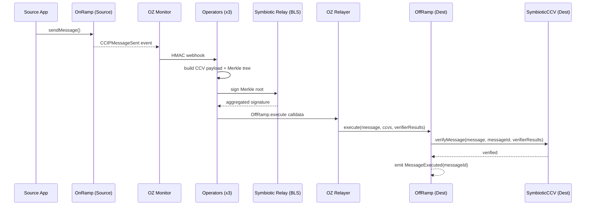

Symbiotic-secured Cross-Chain Verifier for Chainlink CCIP-compatible message verification.

## Overview

The CCV provider watches `CCIPMessageSent` events, builds the verifier payload, collects BLS attestations through Symbiotic relay sidecars, and submits execution calldata to the destination OffRamp path. Success is confirmed when the destination emits `MessageExecuted(messageId)`.

<Callout>

This template supports the Symbiotic CCV path only. The Chainlink auxiliary devenv stack is not required.

</Callout>

## Message Flow



## Contracts and Code

### Contracts

- `contracts/src/ccv/SymbioticCCV.sol`
- `contracts/src/ccv/interfaces/`
- `contracts/src/ccv/libraries/`
- `contracts/src/symbiotic/Settlement.sol`
- `contracts/src/symbiotic/KeyRegistry.sol`
- `contracts/src/symbiotic/Driver.sol`

### Operator

- `operator/src/provider/chainlink_ccv.rs`
- `operator/src/provider/mod.rs`

### Monitor Templates

- `config/templates/oz-monitor/monitors/ccip_message_sent.json`

## Configuration

Select CCV in `config/environments/<env>.json`:

```json
{
  "activeProvider": "chainlink_ccv"
}
```

Chain IDs from `chains.source.chainId` and `chains.destination.chainId` are used as CCIP chain selectors at runtime.

Address resolution order:

1. `CCV_*` environment variables
2. `deployments/<env>.json`

Available overrides:

| Variable | Description |
|----------|-------------|
| `CCV_SOURCE_ADDRESS` | SymbioticCCV on source chain |
| `CCV_DEST_ADDRESS` | SymbioticCCV on destination chain |
| `CCV_SOURCE_ONRAMP_ADDRESS` | Source OnRamp-compatible contract |
| `CCV_DEST_OFFRAMP_ADDRESS` | Destination OffRamp submit target |

Local is supported; testnet and mainnet are not yet. `make watch` only succeeds once destination `MessageExecuted(messageId)` is observed.

See [Setup](/symbiotic/setup) and [CLI & API Reference](/symbiotic/cli) for operation.
