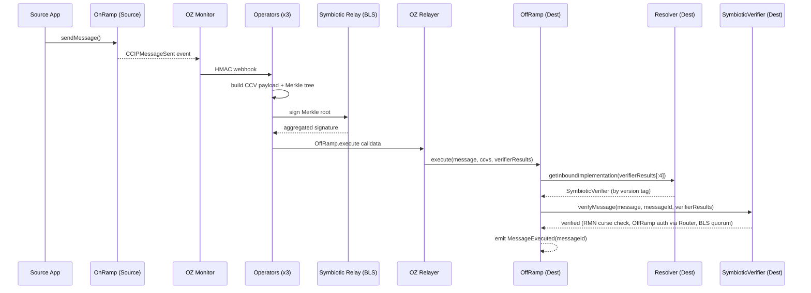

Symbiotic-secured Cross-Chain Verifier for Chainlink CCIP-compatible message verification.

## Overview

The CCV provider watches `CCIPMessageSent` events, builds the verifier payload, collects BLS attestations through Symbiotic relay sidecars, and submits execution calldata to the destination OffRamp path. Success is confirmed when the destination emits `MessageExecuted(messageId)`.

<Callout>

This template supports the Symbiotic CCV path only. The Chainlink auxiliary devenv stack is not required.

</Callout>

## On-Chain Architecture: Resolver + Verifier

The CCV identity that CCIP references is split across two contracts:

- **Resolver** — Chainlink's stock `VersionedVerifierResolver`, deployed via Chainlink's `CREATE2Factory` so it has the **same address on every supported chain**. This is the permanent address: it is what OnRamp/OffRamp configuration and the CCIP indexer register, and it never changes. It holds two registries: version prefix → inbound verifier implementation, and destination chain selector → outbound implementation.
- **Verifier implementation** — `SymbioticVerifier`, which inherits Chainlink's `BaseVerifier` and adds Symbiotic BLS quorum verification against `Settlement`. Implementations are versioned and replaceable.

Every verifier result starts with a 4-byte version tag (`0x1a75bd93` for v1, derived from `keccak256("SymbioticCCV 1.0.0")`). Signers commit to `keccak256(versionTag ‖ messageId)`, so the tag both routes the message to the right implementation and prevents a signature produced for one implementation from being replayed against another.

### Upgrading the verifier

Deploying verification logic v2 never changes the address integrators use:

1. Deploy the new `SymbioticVerifier` with a new version tag and configure its lanes.
2. Register it on the resolver: `applyInboundImplementationUpdates([{tag_v2, v2}])` — v1 and v2 now coexist, and in-flight messages signed under v1 still resolve to v1.
3. Switch outbound per lane: `applyOutboundImplementationUpdates([{selector, v2}])` — new messages carry v2's tag.
4. After v1 traffic drains, optionally retire v1's tag by registering it to `address(0)`.

## Message Flow



## Verification Gas Budget

Each lane's `gasForVerification` (set via `applyRemoteChainConfigUpdates`, returned by `getFee`) must cover the full `verifyMessage` call. Its cost scales with the validator set in three ways:

- **proof handling in the verifier** — the quorum proof embeds the entire validator set (64 bytes per validator), and the current `SymbioticVerifier` implementation copies the proof byte-by-byte before handing it to `Settlement`. At large sets this copy dominates everything else;
- **signature verification** (`SigVerifierBlsBn254Simple`) — hashes the full validator-set data against the committed set, then pays a key decompression plus curve addition for each validator that did *not* sign, plus one BLS pairing (~113k, fixed);
- **fixed base** — `BaseVerifier` ramp/RMN checks and `Settlement` epoch bookkeeping.

Measured end to end with the repo's gas harness (real `SymbioticVerifier` → `Settlement` hop → real `SigVerifierBlsBn254Simple`, synthetic equal-power validator sets):

```bash
cd contracts && forge test --match-contract VerificationGas -vv
```

| Validators | All sign | 33% non-signers (by count) |
|-----------:|---------:|---------------------------:|
| 3   | 292k | 296k |
| 10  | 407k | 421k |
| 25  | 657k | 693k |
| 50  | 1.09M | 1.16M |
| 100 | 2.00M | 2.17M |

The 3-validator row is within ~5% of what Chainlink measured on the staging deployment (299k–312k across live messages), so treat the table as representative. Interpolate for your set size and add a **safety margin (recommend 20%)**. The staging config value of `400000` sits *below* the measured cost of a 10-validator set (407k before margin) — it is sized for the current small staging set, not a constant. (Do not benchmark against the unit tests: `SymbioticVerifier.t.sol` stubs `Settlement`, so its gas numbers exclude all of the above.)

Two caveats when sizing the non-signer allowance:

- Quorum is enforced on **voting power, not head count**. With unequal stake weights, far more than a third of validators (by count) can abstain while quorum still passes — and each absent validator costs decompression + addition. Derive your worst case from the actual power distribution; the table's second column is the equal-power case.
- **Re-evaluate whenever the validator set grows** — operator registration changes the set automatically at epoch boundaries, so an under-provisioned value does not fail immediately; it fails when the set outgrows it, and messages then stall at verification. Alert on validator-set size, not on failures.

Because per-message cost grows roughly linearly with the set (~18k gas per validator end to end in the current implementation), Symbiotic's ZK verification mode — near-constant gas regardless of set size — becomes the cheaper option well before very large sets. If your set is growing past a few dozen validators, evaluate the switch; it deploys as a verifier-implementation upgrade (see above — the resolver address does not change).

## Recommended Verifier Composition (Token Issuers)

**Run the Chainlink committee verifier alongside the Symbiotic verifier as your default.** Two independent CCVs give defense in depth out of the box: a message executes only when both verifiers attest, so compromising either the committee or the Symbiotic validator set alone is not sufficient to forge a message.

Configure both CCVs (the Chainlink committee verifier plus this resolver's address) in your token pool / app CCV list. Symbiotic-only operation is supported, but treat it as a **conscious, documented opt-out** — you are removing an independent verification layer, and you should record that decision and its rationale in your own security documentation.

Token issuers can also **supply their own token as the collateral securing the verifier network** (self-securing collateral). This needs nothing CCV-specific: create a Symbiotic vault, deposit the asset, and have operators opt in — standard [Symbiotic vault creation](https://docs.symbiotic.fi/), with your token as the staked asset backing the validator set's economic security.

## Contracts and Code

### Contracts

- `contracts/src/chainlink/SymbioticVerifier.sol` — verifier implementation (inherits Chainlink `BaseVerifier`)
- Resolver + factory: stock contracts from `@chainlink/contracts-ccip` (`VersionedVerifierResolver`, `CREATE2Factory`) — deployed from the package, no local source
- `contracts/src/symbiotic/Settlement.sol`
- `contracts/src/symbiotic/KeyRegistry.sol`
- `contracts/src/symbiotic/Driver.sol`

### Operator

- `operator/src/provider/chainlink_ccv.rs`
- `operator/src/provider/mod.rs`

### Monitor Templates

- `config/templates/oz-monitor/monitors/ccip_message_sent.json`

## Configuration

Select CCV in `config/environments/<env>.json`:

```json
{
  "activeProvider": "chainlink_ccv"
}
```

CCIP chain selectors come from `chains.source.ccipChainSelector` and `chains.destination.ccipChainSelector`, which are required for non-local environments. They can be overridden at runtime via the `CCV_SOURCE_CHAIN_SELECTOR` / `CCV_DEST_CHAIN_SELECTOR` environment variables. For local Anvil only (chainId `31337`), the selector falls back to `chainId` when `ccipChainSelector` is unset.

Address resolution order:

1. `CCV_*` environment variables
2. `deployments/<env>.json`

The resolver address is the exception: it has no environment override and is always read from `deployments/<env>.json` (`chainlinkCcv.resolver`), matching the CREATE2 determinism guarantee.

Available overrides:

| Variable | Description |
|----------|-------------|
| `CCV_SOURCE_ONRAMP_ADDRESS` | Source OnRamp-compatible contract |
| `CCV_DEST_OFFRAMP_ADDRESS` | Destination OffRamp submit target |
| `CCV_SOURCE_CHAIN_SELECTOR` | Override the source CCIP chain selector |
| `CCV_DEST_CHAIN_SELECTOR` | Override the destination CCIP chain selector |
| `CCV_STORAGE_LOCATION_URIS` | Comma-separated attestation API base URLs advertised on-chain (required for non-local deploys) |

Local and testnet are supported (testnet uses the `testnet-ccv` environment: `config/environments/testnet-ccv.json` and `deployments/testnet-ccv.json`, run via `ENV=testnet-ccv`); mainnet is not yet supported for CCV. `make watch` only succeeds once destination `MessageExecuted(messageId)` is observed.

See [Setup](/symbiotic/setup) and [CLI & API Reference](/symbiotic/cli) for operation.
